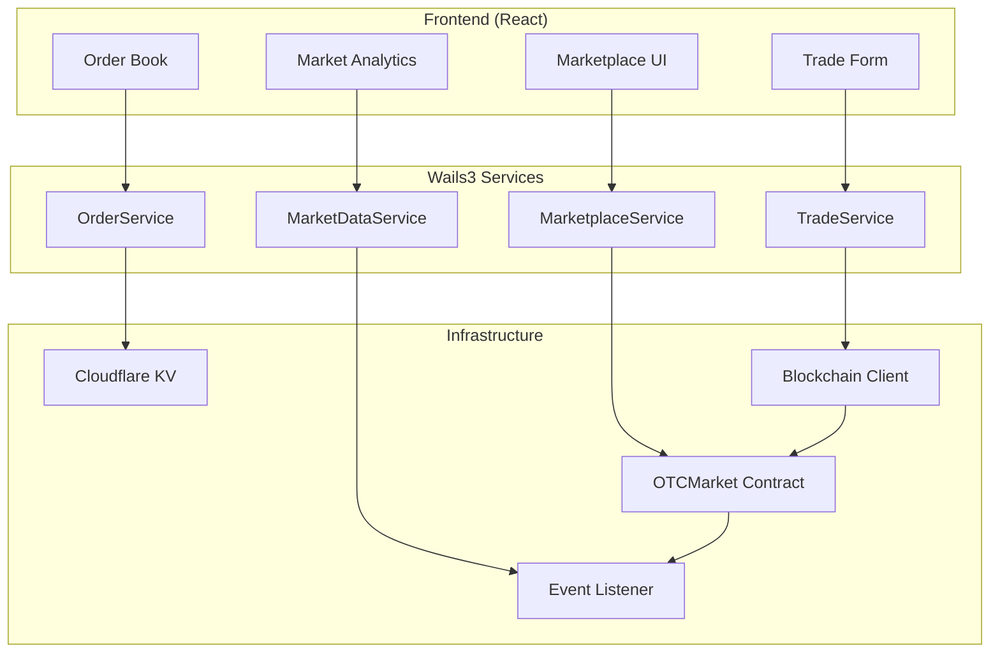

# Design Document: P2P Marketplace

## Overview

The P2P Marketplace is a Wails3 desktop application service that enables secure peer-to-peer trading of KAWAI tokens for USDT without requiring initial liquidity pools. The system leverages the existing OTCMarket smart contract deployed on Monad testnet to provide atomic swaps with escrow protection, while using Cloudflare KV for off-chain data storage and caching.

The marketplace operates as a "bulletin board" style platform where Contributors can list their earned KAWAI tokens for sale, and Investors can browse and purchase these tokens at market-determined prices. This approach enables natural price discovery through supply and demand forces while maintaining security through smart contract escrow.

## Architecture

The P2P Marketplace follows a three-tier architecture:

### 1. Frontend Layer (React + @lobehub/ui)
- **Marketplace Dashboard**: Order book display with real-time updates
- **Order Management**: Create, cancel, and track orders
- **Trade Execution**: Buy orders with transaction confirmation
- **Market Analytics**: Price trends, volume, and market depth

### 2. Service Layer (Wails3 Go Services)
- **MarketplaceService**: Core marketplace operations and business logic
- **OrderService**: Order lifecycle management and validation
- **TradeService**: Trade execution and atomic swap coordination
- **MarketDataService**: Analytics, pricing, and market statistics

### 3. Infrastructure Layer
- **Smart Contract**: OTCMarket contract for atomic swaps and escrow
- **KV Storage**: Multi-namespace Cloudflare KV for order data and cache
- **Blockchain Client**: Monad testnet integration for contract interactions
- **Event System**: Real-time updates via contract event listening



## Components and Interfaces

### MarketplaceService (Wails3 Service)

Primary service for marketplace operations, registered in the Wails application context.

```go
type MarketplaceService struct {
    orderService    *OrderService
    tradeService    *TradeService
    marketData      *MarketDataService
    walletService   *WalletService
    kvStore         *store.KVStore
}

// Wails-exposed methods
func (s *MarketplaceService) GetActiveOrders(sortBy string, filterBy map[string]interface{}) ([]Order, error)
func (s *MarketplaceService) CreateSellOrder(tokenAmount, usdtPrice string) (*OrderResult, error)
func (s *MarketplaceService) BuyOrder(orderID string) (*TradeResult, error)
func (s *MarketplaceService) CancelOrder(orderID string) error
func (s *MarketplaceService) GetUserOrders(walletAddress string) ([]Order, error)
func (s *MarketplaceService) GetMarketStats() (*MarketStats, error)
```

### OrderService

Handles order lifecycle management and validation.

```go
type OrderService struct {
    kvStore         *store.KVStore
    blockchainClient *blockchain.Client
    eventListener   *EventListener
}

type Order struct {
    ID              string    `json:"id"`
    Seller          string    `json:"seller"`
    TokenAmount     string    `json:"tokenAmount"`
    USDTPrice       string    `json:"usdtPrice"`
    PricePerToken   string    `json:"pricePerToken"`
    Status          string    `json:"status"` // active, filled, cancelled
    CreatedAt       time.Time `json:"createdAt"`
    UpdatedAt       time.Time `json:"updatedAt"`
    TxHash          string    `json:"txHash"`
}

func (s *OrderService) ValidateOrderCreation(seller string, tokenAmount, usdtPrice *big.Int) error
func (s *OrderService) StoreOrder(order *Order) error
func (s *OrderService) UpdateOrderStatus(orderID, status string) error
func (s *OrderService) GetOrdersByStatus(status string) ([]Order, error)
```

### TradeService

Manages trade execution and atomic swaps.

```go
type TradeService struct {
    blockchainClient *blockchain.Client
    orderService     *OrderService
    walletService    *WalletService
}

type TradeResult struct {
    Success     bool   `json:"success"`
    TxHash      string `json:"txHash"`
    OrderID     string `json:"orderID"`
    TokenAmount string `json:"tokenAmount"`
    USDTAmount  string `json:"usdtAmount"`
    Error       string `json:"error,omitempty"`
}

func (s *TradeService) ExecuteTrade(orderID string, buyer string) (*TradeResult, error)
func (s *TradeService) ValidateTradeConditions(orderID string, buyer string) error
func (s *TradeService) ProcessTradeCompletion(orderID, txHash string) error
```

### MarketDataService

Provides market analytics and pricing information.

```go
type MarketDataService struct {
    kvStore      *store.KVStore
    orderService *OrderService
}

type MarketStats struct {
    LowestAskPrice    string `json:"lowestAskPrice"`
    HighestBidPrice   string `json:"highestBidPrice"`
    Volume24h         string `json:"volume24h"`
    PriceChange24h    string `json:"priceChange24h"`
    ActiveOrdersCount int    `json:"activeOrdersCount"`
    RecentTrades      []Trade `json:"recentTrades"`
}

func (s *MarketDataService) CalculateMarketStats() (*MarketStats, error)
func (s *MarketDataService) GetPriceTrends(timeframe string) ([]PricePoint, error)
func (s *MarketDataService) GetMarketDepth() (*MarketDepth, error)
```

## Data Models

### Order Storage Schema (Cloudflare KV)

Orders are stored in the `orders` namespace with the following key structure:

```
Key Format: "order:{orderID}"
Value: JSON-serialized Order struct

Index Keys:
- "orders:active" -> List of active order IDs
- "orders:user:{walletAddress}" -> List of user's order IDs
- "orders:price_sorted" -> Price-sorted list of active order IDs
```

### Market Data Cache Schema

Market statistics and analytics are cached for performance:

```
Key Format: "market:stats" -> Current market statistics
Key Format: "market:trends:{timeframe}" -> Price trend data
Key Format: "market:depth" -> Market depth information
TTL: 60 seconds for real-time data, 300 seconds for historical data
```

### Event Log Schema

Contract events are stored for audit and recovery:

```
Key Format: "events:{blockNumber}:{txHash}:{logIndex}"
Value: JSON-serialized event data with timestamp
```

## Correctness Properties

*A property is a characteristic or behavior that should hold true across all valid executions of a system-essentially, a formal statement about what the system should do. Properties serve as the bridge between human-readable specifications and machine-verifiable correctness guarantees.*

### Property 1: Order Creation Balance Validation
*For any* contributor and token amount, when creating a sell order, the order should only be created if the contributor has sufficient KAWAI token balance
**Validates: Requirements 1.1**

### Property 2: Order Creation Input Validation
*For any* order creation attempt, the system should reject orders that are missing token amount, USDT price, or seller wallet address
**Validates: Requirements 1.2**

### Property 3: Token Escrow Locking
*For any* successfully created order, the seller's KAWAI token balance should decrease by exactly the locked token amount
**Validates: Requirements 1.3**

### Property 4: Order ID Uniqueness
*For any* set of successfully created orders, all order IDs should be unique and each order should be stored in the order book
**Validates: Requirements 1.4**

### Property 5: Order Cancellation Token Return
*For any* order that is created and then cancelled, the seller's KAWAI token balance should return to the original amount (round-trip property)
**Validates: Requirements 1.5**

### Property 6: Order Display Sorting
*For any* set of active orders, when displayed in the marketplace, they should be correctly sorted by price in ascending order
**Validates: Requirements 2.1**

### Property 7: Order Display Information Completeness
*For any* displayed order, the interface should show token amount, USDT price, price per token, and seller address
**Validates: Requirements 2.2**

### Property 8: Order Filtering and Sorting
*For any* order set and sort criteria (price, amount, creation date), the filtering system should return correctly ordered results
**Validates: Requirements 2.3**

### Property 9: Partial Fill Amount Updates
*For any* order that is partially filled, the displayed remaining amount should equal the original amount minus the filled amount
**Validates: Requirements 2.4**

### Property 10: Completed Order Removal
*For any* order that is completed or cancelled, it should not appear in the active order listings
**Validates: Requirements 2.5**

### Property 11: Trade Execution Balance Validation
*For any* buy order attempt, the trade should only execute if the buyer has sufficient USDT balance
**Validates: Requirements 3.1**

### Property 12: Atomic Swap Execution
*For any* successful trade execution, both the KAWAI token transfer to buyer and USDT transfer to seller should complete simultaneously
**Validates: Requirements 3.2**

### Property 13: Atomic Swap Failure Rollback
*For any* trade execution where either transfer fails, both transfers should be reverted to maintain atomicity
**Validates: Requirements 3.3**

### Property 14: Trade Completion Event Emission
*For any* successfully completed trade, a trade completion event should be emitted with correct order and trade details
**Validates: Requirements 3.4**

### Property 15: Partial Order State Management
*For any* partial buy execution, the original order should remain active with the remaining amount updated correctly
**Validates: Requirements 3.5**

### Property 16: User Order History Completeness
*For any* user requesting their order history, all their past orders should be returned with status and timestamps
**Validates: Requirements 4.1**

### Property 17: Trade History Information Completeness
*For any* trade history display, it should include order details, execution price, and completion status
**Validates: Requirements 4.2**

### Property 18: Real-time Status Updates
*For any* order status change, the user interface should reflect the updated status immediately
**Validates: Requirements 4.3**

### Property 19: Active Order Status Display
*For any* user with active orders, the tracking system should display current status and remaining amounts accurately
**Validates: Requirements 4.4**

### Property 20: Order Detail Metadata Completeness
*For any* order detail view, it should display creation time, last update, and transaction hashes
**Validates: Requirements 4.5**

### Property 21: Market Data Accuracy
*For any* marketplace view, the displayed lowest ask price and highest recent trade price should accurately reflect current market state
**Validates: Requirements 5.1**

### Property 22: Market Metrics Calculation
*For any* 24-hour period, the analytics system should correctly compute trading volume and price ranges
**Validates: Requirements 5.2**

### Property 23: Price Trend Data Completeness
*For any* price trend display, it should include recent trade history with accurate timestamps and prices
**Validates: Requirements 5.3**

### Property 24: Market Depth Calculation
*For any* market depth display, it should correctly show the distribution of orders across different price levels
**Validates: Requirements 5.5**

### Property 25: Smart Contract Parameter Validation
*For any* order creation, the contract interface should call createOrder with properly formatted parameters
**Validates: Requirements 6.2**

### Property 26: Trade Execution Contract Integration
*For any* trade execution, the contract interface should invoke buyOrder ensuring atomic execution
**Validates: Requirements 6.3**

### Property 27: Order Cancellation Contract Integration
*For any* order cancellation, the contract interface should call cancelOrder and verify token return
**Validates: Requirements 6.4**

### Property 28: Contract Event Processing
*For any* contract event (OrderCreated, OrderFilled, OrderCancelled), the event listener should capture and process it correctly
**Validates: Requirements 6.5**

### Property 29: Service Method Input Validation
*For any* marketplace service method call, input data should be validated before creating orders via smart contract
**Validates: Requirements 7.1**

### Property 30: Service Data Formatting
*For any* order listing request, the marketplace service should return properly structured data with filtering and sorting
**Validates: Requirements 7.2**

### Property 31: Trade Service Execution
*For any* buy request through service calls, the trade service should execute trades and return transaction status and details
**Validates: Requirements 7.3**

### Property 32: Data Persistence
*For any* order creation, the order information should be persisted in the multi-namespace KV store
**Validates: Requirements 7.4**

### Property 33: Service Error Handling
*For any* service method error, the system should return appropriate Go error types with descriptive messages
**Validates: Requirements 7.5**

### Property 34: Wallet Address Integration
*For any* marketplace operation, the system should use the connected wallet address for authorization
**Validates: Requirements 8.1**

### Property 35: Order Creation Authorization
*For any* order creation through Wails services, only the connected wallet owner should be able to create orders for their tokens
**Validates: Requirements 8.2**

### Property 36: Order Cancellation Authorization
*For any* order cancellation via service calls, the system should verify the requester is the original order creator
**Validates: Requirements 8.3**

### Property 37: Data Access Control
*For any* user-specific data access, the system should filter results based on the connected wallet address
**Validates: Requirements 8.4**

### Property 38: Wallet Service Integration
*For any* Wails service method requiring wallet operations, the wallet service should handle transaction signing and blockchain interactions
**Validates: Requirements 8.5**

## Error Handling

The marketplace implements comprehensive error handling across all layers:

### Service Layer Errors
- **ValidationError**: Input validation failures with specific field information
- **InsufficientBalanceError**: Token or USDT balance insufficient for operation
- **OrderNotFoundError**: Requested order does not exist or is inactive
- **UnauthorizedError**: User not authorized to perform the requested operation
- **ContractError**: Smart contract interaction failures with transaction details

### Blockchain Integration Errors
- **ConnectionError**: Unable to connect to Monad testnet
- **TransactionError**: Transaction failed with gas estimation or execution issues
- **EventListenerError**: Contract event listening failures with retry logic

### Data Storage Errors
- **KVStoreError**: Cloudflare KV storage operation failures
- **SerializationError**: JSON serialization/deserialization failures
- **CacheError**: Cache invalidation or update failures

### Error Recovery Strategies
- **Retry Logic**: Automatic retry for transient blockchain and storage errors
- **Circuit Breaker**: Prevent cascade failures during high error rates
- **Graceful Degradation**: Fallback to cached data when real-time updates fail
- **User Notification**: Clear error messages with suggested actions

## Testing Strategy

The P2P Marketplace uses a dual testing approach combining unit tests for specific scenarios and property-based tests for comprehensive validation.

### Unit Testing
Unit tests focus on specific examples, edge cases, and integration points:
- **Service Method Testing**: Verify individual service methods with known inputs
- **Error Condition Testing**: Test specific error scenarios and recovery
- **Integration Testing**: Verify service interactions and data flow
- **Mock Contract Testing**: Test contract interactions with simulated responses

### Property-Based Testing
Property tests verify universal properties across all inputs using **Rapid** (Go property testing library):
- **Minimum 100 iterations** per property test to ensure comprehensive coverage
- **Random input generation** for orders, trades, and market conditions
- **Invariant verification** across all valid system states
- **Edge case discovery** through automated input exploration

Each property test references its corresponding design document property:
```go
// Feature: p2p-marketplace, Property 1: Order Creation Balance Validation
func TestOrderCreationBalanceValidation(t *testing.T) {
    rapid.Check(t, func(t *rapid.T) {
        // Generate random contributor and token amount
        contributor := generateRandomAddress(t)
        tokenAmount := rapid.Uint64Range(1, 1000000).Draw(t, "tokenAmount")
        balance := rapid.Uint64Range(0, 2000000).Draw(t, "balance")
        
        // Test property: order creation should succeed only if balance >= tokenAmount
        result := marketplaceService.CreateSellOrder(contributor, tokenAmount, 100)
        
        if balance >= tokenAmount {
            assert.NoError(t, result.Error)
        } else {
            assert.Error(t, result.Error)
            assert.Contains(t, result.Error.Error(), "insufficient balance")
        }
    })
}
```

### Integration Testing
- **End-to-End Workflows**: Complete order creation, execution, and cancellation flows
- **Blockchain Integration**: Test against Monad testnet with real contract interactions
- **Event Processing**: Verify contract event capture and processing
- **Data Consistency**: Ensure KV store and blockchain state remain synchronized

### Performance Testing
- **Load Testing**: Simulate high order volume and concurrent trades
- **Latency Testing**: Measure response times for critical operations
- **Memory Testing**: Verify efficient resource usage during extended operation
- **Cache Performance**: Test KV store performance under various load conditions