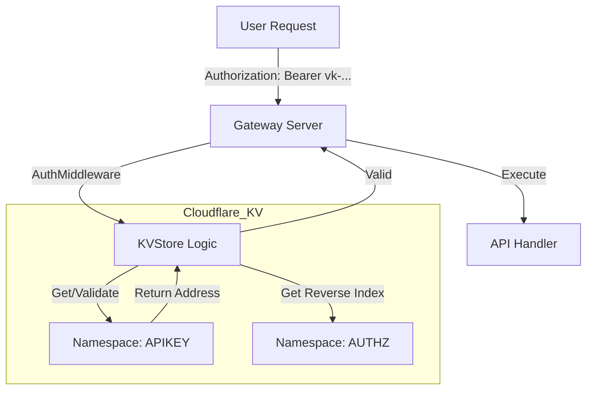

# Analisis Penggunaan Cloudflare KV: AUTHZ dan APIKEY

## 📋 Kesimpulan
**YA**, terdapat penggunaan Cloudflare KV secara aktif untuk `AUTHZ` dan `APIKEY` dalam codebase, khususnya di dalam package `pkg/store`, `pkg/gateway`, dan `internal/constant`.

Implementasi ini **bukan** berbentuk script Cloudflare Workers (`wrangler.toml`), melainkan aplikasi Go yang memanggil API Cloudflare secara langsung (via library `cloudflare-go`) untuk berinteraksi dengan KV store.

---

## 🔍 Detail Temuan

### 1. Definisi Konfigurasi (`internal/constant/cloudflare.go`)
Namespace ID untuk `AUTHZ` dan `APIKEY` didefinisikan secara hardcoded (namun terobfuscasi) di file constant.

```go
// internal/constant/cloudflare.go

const (
    // ...
    // - Apikey: API key management (apikey -> address)
    // - Authz: Authorization reverse index (address -> apikey)
    obfuscatedCfKvApikeyNamespaceId = "00nCO0uoa1ze1slnU2O8B3caSDyFLI6mU/pdIoUya9Q="
    obfuscatedCfKvAuthzNamespaceId = "TbCDIs2Se4LdZCjKU1VQVPPMSDSF3eGZw79L1aNAxXe="
)

// Getter functions
func GetCfKvApikeyNamespaceId() string { ... }
func GetCfKvAuthzNamespaceId() string { ... }
```

### 2. Implementasi Logic (`pkg/store/`)

#### a. `pkg/store/kvstore.go`
Struct `KVStore` menyimpan state untuk koneksi ke Cloudflare dan ID namespace.

```go
type KVStore struct {
    client    *cloudflare.API
    // ...
    authzNamespaceID          string // Reverse index: address -> apikey
}

func NewMultiNamespaceKVStore() (*KVStore, error) {
    // ...
    // Mengambil ID namespace dari constant
    authzNamespaceID:          constant.GetCfKvAuthzNamespaceId(),
    // ...
}
```

#### b. `pkg/store/apikey.go`
File ini berisi logika CRUD (Create, Read, Delete) untuk API Key yang berinteraksi dengan dua namespace KV secara bersamaan:

1.  **Namespace `APIKEY`** (Forward Index):
    *   **Key**: `vk-<random-hex>` (API Key)
    *   **Value**: Wallet Address
    *   **Usage**: Digunakan untuk validasi saat request masuk (mencari siapa pemilik key).

2.  **Namespace `AUTHZ`** (Reverse Index):
    *   **Key**: Wallet Address
    *   **Value**: API Key
    *   **Usage**: Digunakan untuk mencari API Key aktif milik user tertentu (misalnya untuk ditampilkan di dashboard).

Contoh logika penyimpanan dual-write:
```go
// pkg/store/apikey.go

func (s *KVStore) CreateAPIKey(...) {
    // 1. Simpan di Namespace APIKEY (Key -> Address)
    s.client.WriteWorkersKVEntry(..., constant.GetCfKvApikeyNamespaceId(), apiKey, address)

    // 2. Simpan di Namespace AUTHZ (Address -> Key)
    s.client.WriteWorkersKVEntry(..., s.authzNamespaceID, address, apiKey)
}
```

### 3. Penggunaan Aktif (`pkg/gateway/`)

#### a. `pkg/gateway/middleware.go`
Middleware `AuthMiddleware` menggunakan `KVStore` untuk memvalidasi setiap request yang masuk ke API.

```go
func AuthMiddleware(kvStore *store.KVStore) gin.HandlerFunc {
    return func(c *gin.Context) {
        // ...
        // Validasi ke Cloudflare KV
        walletAddress, err := kvStore.ValidateAPIKey(ctx, apiKey)
        // ...
    }
}
```

#### b. `pkg/gateway/server.go`
Server memasang middleware ini ke semua route di group `/v1`.

```go
// pkg/gateway/server.go
func (s *Server) setupRoutes() {
    v1 := s.engine.Group("/v1")
    v1.Use(AuthMiddleware(s.kvStore)) // <-- Middleware dipasang disini
    // ...
}
```

---

## diagram Alur Data


