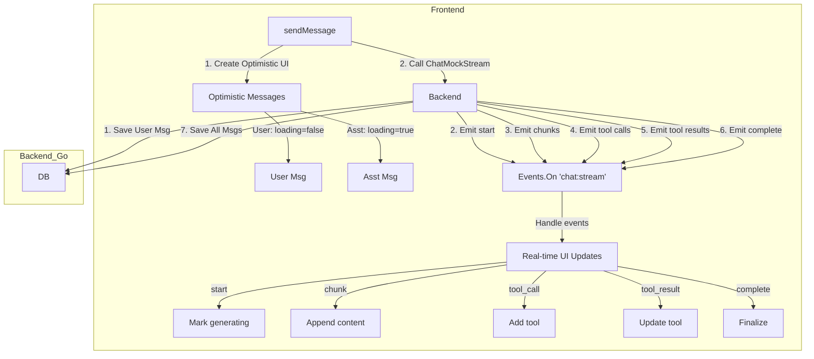

# Chat Message Flow Documentation

## Overview

Dokumen ini menjelaskan alur data untuk chat messages antara Go backend dan TypeScript frontend, khususnya untuk fitur tools, reasoning, RAG chunks, dan metadata lainnya.

## API Modes

Ada 3 mode yang tersedia di `generateAIChat.ts`:

| Mode | Deskripsi | Use Case |
|------|-----------|----------|
| `REAL` | Memanggil backend dengan LLM asli | Production |
| `BACKEND_MOCK` | Memanggil backend mock (save ke DB, tanpa LLM) | Testing data flow end-to-end |
| `FRONTEND_MOCK` | Mock di frontend saja (tidak save ke DB) | UI/UX development cepat |

## Type Definitions

### Go Backend Types (`internal/services/agent_chat_service.go`)

```go
// UIChatMessage - Digunakan untuk SEMUA message roles: user, assistant, tool
// Ini adalah single unified type yang match dengan frontend UIChatMessage
type UIChatMessage struct {
    ID           string                  `json:"id"`
    Role         UIMessageRoleType       `json:"role"`           // "user", "assistant", "tool"
    Content      string                  `json:"content"`
    
    // For role='assistant':
    Tools        []ChatToolPayload       `json:"tools,omitempty"`        // Tool calls
    ToolMessages []UIChatMessage         `json:"toolMessages,omitempty"` // Tool results (role='tool')
    Children     []AssistantContentBlock `json:"children,omitempty"`     // Grouped content
    Reasoning    *ModelReasoning         `json:"reasoning,omitempty"`    // Thinking content
    
    // For role='tool':
    ToolCallID   string                  `json:"tool_call_id,omitempty"` // Links to Tools[].ID
    Plugin       *ChatPluginPayload      `json:"plugin,omitempty"`       // Tool metadata
    PluginState  interface{}             `json:"pluginState,omitempty"`  // Structured result
    
    // Common fields:
    ChunksList   []ChatFileChunk         `json:"chunksList,omitempty"`   // RAG chunks
    Search       *GroundingSearch        `json:"search,omitempty"`       // Web citations
    Usage        *ModelUsage             `json:"usage,omitempty"`        // Token usage
    Performance  *ModelPerformance       `json:"performance,omitempty"`  // Metrics
    // ... other fields
}
```

**Catatan**: Tidak ada type `UIToolMessage` terpisah. Tool messages adalah `UIChatMessage` dengan `Role: "tool"`.

### TypeScript Frontend Types (`frontend/src/types/message/ui/chat.ts`)

```typescript
// UIChatMessage - Digunakan untuk semua messages di messagesMap
interface UIChatMessage {
  id: string;
  role: UIMessageRoleType;  // 'user' | 'assistant' | 'tool'
  content: string;
  
  // Tool-related (untuk role='assistant')
  tools?: ChatToolPayload[];           // Tool calls
  children?: AssistantContentBlock[];  // Grouped content
  
  // Tool-related (untuk role='tool')
  tool_call_id?: string;     // Matches tools[].id
  plugin?: ChatPluginPayload;
  pluginState?: any;         // Structured result untuk UI rendering
  
  // Other fields
  chunksList?: ChatFileChunk[];
  reasoning?: ModelReasoning;
  search?: GroundingSearch;
  usage?: ModelUsage;
  performance?: ModelPerformance;
  // ...
}
```

## Unified Type: UIChatMessage

Backend dan frontend menggunakan **satu type yang sama**: `UIChatMessage`.

Tidak ada type terpisah untuk tool messages. Tool messages adalah `UIChatMessage` dengan:
- `role: 'tool'`
- `tool_call_id`: Links ke `tools[].id` di parent assistant message
- `plugin`: Metadata tool (identifier, apiName, arguments)
- `pluginState`: Structured result untuk UI rendering

**Backend Response** (`ChatMock` returns array):
```go
// Returns all messages: [user, assistant, tool1, tool2, ...]
return []UIChatMessage{
    {Role: UIMessageRoleUser, Content: req.Message, ...},
    {Role: UIMessageRoleAssistant, Tools: tools, ...},
    {Role: UIMessageRoleTool, ToolCallID: "tool_1", PluginState: result, ...},
    {Role: UIMessageRoleTool, ToolCallID: "tool_2", PluginState: result, ...},
}, nil
```

**Frontend Processing** (`generateAIChat.ts`):
```typescript
// Backend returns array of all messages
const mockMessages = await backendAgentChat.sendMessageMock({...});

// Replace optimistic messages with backend messages
const filteredMessages = messages.filter(
  m => m.id !== messageUserId && m.id !== messageAssistantId
);
for (const msg of mockMessages) {
  filteredMessages.push(msg as UIChatMessage);
}
state.messagesMap[mapKey] = filteredMessages;
```

**UI Lookup** (`Tool/Render/index.tsx`):
```typescript
const toolMessage = useChatStore(
  chatSelectors.getMessageByToolCallId(toolCallId)
);
// toolMessage adalah UIChatMessage dengan role='tool'
```

## Database Query Flow (switchTopic → refreshMessages)

Ketika user switch topic atau refresh messages, data diambil dari database bukan dari backend response langsung.

**Flow**:
```
switchTopic(topicId)
    → refreshMessages()
        → MessageModel.query({ topicId })
            → DB queries (messages, plugins, files, chunks, etc.)
                → Map to UIChatMessage[]
```

**Kenapa ini juga worked?**

Di `database/models/message.ts`, method `query()` melakukan mapping dari database tables ke `UIChatMessage`:

```typescript
// Dari message.ts query() method:
return {
  id: message.id,
  role: message.role,                    // 'user' | 'assistant' | 'tool'
  content: getNullableString(message.content),
  
  // Tool-specific fields (dari table message_plugins)
  tool_call_id: plugin ? getNullableString(plugin.toolCallId) : undefined,
  plugin: plugin ? {
    apiName: getNullableString(plugin.apiName),
    arguments: getNullableString(plugin.arguments),
    identifier: getNullableString(plugin.identifier),
    type: getNullableString(plugin.type),
  } : undefined,
  pluginState: plugin ? parseNullableJSON(plugin.state) : undefined,
  
  // Other fields...
  tools: parseNullableJSON(message.tools),
  reasoning: parseNullableJSON(message.reasoning),
  chunksList: [...],
  // ...
} as UIChatMessage;
```

**Database Schema**:
```
messages table:
  - id, role, content, tools (JSON), reasoning (JSON), ...

message_plugins table (untuk role='tool'):
  - id (same as message.id)
  - toolCallId    → maps to tool_call_id
  - apiName       → maps to plugin.apiName
  - arguments     → maps to plugin.arguments
  - identifier    → maps to plugin.identifier
  - type          → maps to plugin.type
  - state (JSON)  → maps to pluginState
```

**Key Insight**: 

Backend mock menyimpan tool messages ke database dengan struktur yang benar:
1. `messages` table: `id`, `role='tool'`, `content`, dll
2. `message_plugins` table: `toolCallId`, `apiName`, `state` (pluginState), dll

Ketika `refreshMessages()` query dari database, `MessageModel.query()` melakukan JOIN dan mapping yang menghasilkan `UIChatMessage` dengan field `tool_call_id`, `plugin`, `pluginState` yang sama persis dengan yang di-return dari backend response.

**Consistency**: Baik dari backend response langsung maupun dari database query, hasilnya adalah `UIChatMessage` yang identik. Ini karena:
1. Backend menyimpan dengan struktur yang benar ke database
2. Database query memetakan ke struktur `UIChatMessage` yang sama
3. Frontend menerima type yang sama dari kedua source

## Data Flow Diagram

```
┌─────────────────────────────────────────────────────────────────────┐
│                         BACKEND_MOCK Flow                           │
└─────────────────────────────────────────────────────────────────────┘

┌──────────────┐     ChatRequest      ┌──────────────────────────────┐
│   Frontend   │ ──────────────────▶  │   AgentChatService.ChatMock  │
│              │                      │                              │
│ generateAI   │                      │  1. Save user message to DB  │
│ Chat.ts      │                      │  2. Save assistant message   │
│              │                      │  3. Save tool messages (11x) │
│              │                      │  4. Build UIChatMessage      │
└──────────────┘                      └──────────────────────────────┘
       ▲                                           │
       │                                           │
       │         UIChatMessage                     │
       │         (with toolMessages[])             │
       └───────────────────────────────────────────┘

┌─────────────────────────────────────────────────────────────────────┐
│                    Frontend State Update                            │
└─────────────────────────────────────────────────────────────────────┘

messagesMap[sessionKey] = [
  { id: "user_msg_1", role: "user", content: "..." },
  
  { id: "asst_msg_1", role: "assistant", content: "...",
    tools: [                          // Tool calls
      { id: "tool_1", apiName: "search", ... },
      { id: "tool_2", apiName: "listLocalFiles", ... },
    ],
    reasoning: { content: "..." },    // Thinking
    chunksList: [...],                // RAG chunks
    search: { citations: [...] },     // Web citations
    usage: { totalTokens: 230 },
    performance: { tps: 45.2 },
  },
  
  // Tool messages (dari toolMessages[])
  { id: "tool_msg_1", role: "tool", tool_call_id: "tool_1",
    content: "{...}",                 // JSON result
    pluginState: { results: [...] },  // Structured for UI
    plugin: { apiName: "search", identifier: "lobe-web-browsing" },
  },
  { id: "tool_msg_2", role: "tool", tool_call_id: "tool_2",
    pluginState: { listResults: [...] },
    plugin: { apiName: "listLocalFiles", identifier: "lobe-local-system" },
  },
  // ... more tool messages
]
```

### BACKEND_MOCK_STREAM Flow



```text
Proposed Architecture untuk Mock Stream

     ┌─────────────────────────────────────────────────────────────────┐
     │ Frontend                                                        │
     │                                                                 │
     │  sendMessage() ────────────────────────────────────────────┐    │
     │       │                                                    │    │
     │       │  1. Create optimistic UI                           │    │
     │       │  2. Call ChatMockStream()                          │    │
     │       ▼                                                    │    │
     │  [Optimistic Messages]                                     │    │
     │  - User message (loading=false)                            │    │
     │  - Assistant message (loading=true)                        │    │
     │                                                            │    │
     │  Events.On('chat:stream') ◄────────────────────────────────┼────┤
     │       │                                                    │    │
     │       │  Handle events:                                    │    │
     │       │  - start: Mark as generating                       │    │
     │       │  - chunk: Append content                           │    │
     │       │  - tool_call: Add tool to message                  │    │
     │       │  - tool_result: Update tool message                │    │
     │       │  - complete: Finalize message                      │    │
     │       ▼                                                    │    │
     │  [Real-time UI Updates]                                    │    │
     └─────────────────────────────────────────────────────────────────┘
                                   ▲
                                   │ Events via Wails
                                   │
     ┌─────────────────────────────────────────────────────────────────┐
     │ Backend (Go) - ChatMockStream()                                 │
     │                                                                 │
     │  1. Save user message to DB                                     │
     │                                                                 │
     │  2. Emit("chat:stream", {type: "start", message_id: "..."})     │
     │     └── delay 200ms                                             │
     │                                                                 │
     │  3. Emit content in chunks:                                     │
     │     └── For each word/chunk:                                    │
     │         Emit("chat:stream", {type: "chunk", content: "..."})    │
     │         delay 50-100ms                                          │
     │                                                                 │
     │  4. Emit tool calls one by one:                                 │
     │     └── For each tool:                                          │
     │         Emit("chat:stream", {type: "tool_call", tool: {...}})   │
     │         delay 500-1000ms (simulating execution)                 │
     │         Emit("chat:stream", {type: "tool_result", ...})         │
     │                                                                 │
     │  5. Emit("chat:stream", {type: "complete", ...})                │
     │                                                                 │
     │  6. Save all messages to DB                                     │
     │                                                                 │
     │  7. Return final []UIChatMessage                                │
     └─────────────────────────────────────────────────────────────────┘
```

## Tool Message Lookup Flow

```
┌─────────────────────────────────────────────────────────────────────┐
│              How UI Determines Tool Loading State                   │
└─────────────────────────────────────────────────────────────────────┘

AssistantMessage
    │
    ├── tools.map((tool) => <Tool ... />)
    │       │
    │       ▼
    │   Tool Component
    │       │
    │       ├── isLoading = isInToolsCalling(messageId, index)
    │       │       │
    │       │       └── Checks: toolCallingStreamIds[id][index]
    │       │                   messageInToolsCallingIds.includes(id)
    │       │
    │       └── <ToolTitle ... />
    │               │
    │               └── isLoading = isToolApiNameShining(messageId, index, toolCallId)
    │                       │
    │                       ├── toolMessageId = getMessageByToolCallId(toolCallId)?.id
    │                       │       │
    │                       │       └── Mencari di messagesMap:
    │                       │           message.tool_call_id === toolCallId
    │                       │
    │                       └── if (!toolMessageId) return TRUE  // Loading!
    │                           else return isPluginApiInvoking(toolMessageId)

MASALAH SEBELUMNYA:
- toolMessages tidak ada di messagesMap
- getMessageByToolCallId() return undefined
- isToolApiNameShining() return TRUE (loading state)

SOLUSI:
- Backend mengirim toolMessages[] di UIChatMessage
- Frontend push toolMessages ke messagesMap sebagai UIChatMessage dengan role='tool'
- getMessageByToolCallId() sekarang menemukan tool message
- isToolApiNameShining() return FALSE (not loading)
```

## Content vs PluginState

Beberapa tools menggunakan `content` (JSON string), beberapa menggunakan `pluginState` (structured object):

| Tool | content | pluginState | UI Component |
|------|---------|-------------|--------------|
| web-browsing/search | ✅ JSON | - | SearchResults |
| web-browsing/crawlSinglePage | - | ✅ object | CrawlResult |
| local-system/listLocalFiles | - | ✅ object | ListFiles |
| local-system/readLocalFile | - | ✅ object | ReadLocalFile |
| local-system/moveLocalFiles | - | ✅ object | MoveFiles |
| dalle/text2image | - | ✅ array | DalleImages |
| code-interpreter/python | ✅ JSON | - | CodeResult |

UI Component (`Render/index.tsx`) memilih renderer berdasarkan `apiName` dan menggunakan `pluginState` untuk structured data.

## File References

### Backend
- `internal/services/agent_chat_service.go` - Type definitions, Chat() method
- `internal/services/agent_chat_service_mock.go` - ChatMock() dengan semua mock data

### Frontend
- `frontend/src/types/message/ui/chat.ts` - UIChatMessage type
- `frontend/src/store/chat/slices/aiChat/actions/generateAIChat.ts` - API mode handlers
- `frontend/src/store/chat/slices/message/selectors.ts` - getMessageByToolCallId, isToolApiNameShining
- `frontend/src/features/Conversation/Messages/Assistant/Tool/` - Tool UI components
- `frontend/src/tools/local-system/Render/` - Local system tool renderers

### Wails Bindings (Auto-generated)
- `frontend/bindings/github.com/kawai-network/veridium/internal/services/models.js` - Generated types
