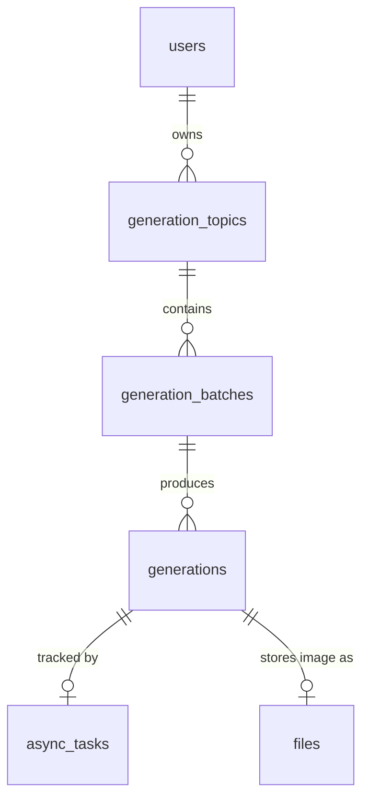
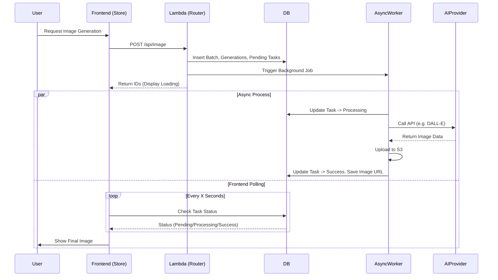

# Image Generation Implementation in Lobe Chat

This document details how the *image generation* feature works within the Lobe Chat codebase. The workflow involves interactions between the frontend, backend lambda, asynchronous processing (async tasks), and integration with AI providers (such as OpenAI, ComfyUI, etc.).

## 1. Frontend: Request Initiation

The process begins on the user side in the frontend.

*   **Service**: `src/services/textToImage.ts`
    *   The frontend uses `ImageGenerationService` to send a POST request to the API endpoint.
    *   The payload includes parameters such as `prompt`, `model`, `aspectRatio`, etc.

## 2. Backend: Router & Database Preparation (Lambda)

The request enters the backend via the TRPC router.

*   **Router**: `src/server/routers/lambda/image.ts`
    *   **Validation**: Validates user input using the Zod schema (`createImageInputSchema`).
    *   **Image Conversion**: If there is image input (for i2i), image URLs are converted to S3 keys for security and storage efficiency.
    *   **Database Transaction**:
        1.  **GenerationBatch**: Creates a `GenerationBatch` record to group this request.
        2.  **Generations**: Creates `Generation` records (defaulting to 4 records for 4 image variations) as placeholders.
        3.  **AsyncTasks**: Creates an `AsyncTask` record with a `Pending` status for each generation. This is used to track the process status in the background.
    *   **Async Trigger**: This function calls `asyncCaller.image.createImage` to start the background process without waiting for completion (fire-and-forget).
    *   **Fast Response**: The API returns the batch and generation IDs to the frontend immediately so the UI can display a "loading" state.

## 3. Backend: Async Execution (Async Worker)

The main image generation process happens asynchronously in the background.

*   **Async Worker**: `src/server/routers/async/image.ts`
    *   **Task Identification**: Receives `taskId` and `generationId`.
    *   **Status Update**: Updates the `AsyncTask` status to `Processing`.
    *   **Runtime Initialization**: Uses `initModelRuntimeWithUserPayload` to create an instance of the appropriate provider client (e.g., OpenAI, ComfyUI, etc.) with the user/system API Key.
    *   **AI Call**: Calls the `agentRuntime.createImage` method (see section 4).
    *   **Post-Processing**:
        *   Receives the image result (URL or Base64).
        *   Saves the image to Object Storage (S3) using `generationService.uploadImageForGeneration`.
        *   Creates a thumbnail if necessary.
    *   **DB Finalization**: Updates the `Generation` record with the final image URL and changes the `AsyncTask` status to `Success`.
    *   **Error Handling**: If it fails, the error is caught, categorized, and the task status is changed to `Error`.

## 4. Model Runtime: Provider Integration

This is the layer that communicates directly with third-party APIs.

*   **Location**: `packages/model-runtime/src/core/openaiCompatibleFactory/createImage.ts` (example for OpenAI compatible)
    *   **Parameter Normalization**: Converts Lobe Chat standard parameters into the vendor-specific format.
    *   **API Call**: Sends an HTTP request to the vendor API (e.g., `client.images.generate` for DALL-E 3).
    *   **Response**: Returns the image URL or Base64 data to the async worker.

## 5. Database Schema & Storage

This feature uses several PostgreSQL tables to track status and store generation history. Schema definitions can be found in `packages/database/src/schemas/`.

### Table Structure

1.  **`generation_topics`** (`schemas/generation.ts`)
    *   **Function**: Groups generation history within a single session or topic.
    *   **Key Columns**: `id`, `user_id`, `title`, `cover_url`.

2.  **`generation_batches`** (`schemas/generation.ts`)
    *   **Function**: Stores configuration for a single generation request (since one prompt can generate multiple images at once).
    *   **Key Columns**:
        *   `generation_topic_id`: Relation to topic.
        *   `prompt`, `model`, `provider`: Generation parameters.
        *   `width`, `height`, `config`: Technical configuration.

3.  **`generations`** (`schemas/generation.ts`)
    *   **Function**: Represents a single generated image.
    *   **Key Columns**:
        *   `generation_batch_id`: Relation to batch.
        *   `file_id`: Relation to `files` table (if the image is successfully saved).
        *   `async_task_id`: Relation to `async_tasks` table for status tracking.
        *   `asset`: JSONB containing image URL, thumbnail, and metadata.

4.  **`async_tasks`** (`schemas/asyncTask.ts`)
    *   **Function**: Tracks the execution status of background jobs.
    *   **Status**: `Pending` -> `Processing` -> `Success` / `Error`.
    *   **Key Columns**: `status`, `error`, `duration`.

5.  **`files`** (`schemas/file.ts`)
    *   **Function**: Stores metadata for physical files uploaded to S3 (Object Storage).
    *   **Key Columns**: `url`, `size`, `file_type`, `metadata`.

### Data Relationships

## 6. Frontend: Polling & UI Update

After the initial request, the frontend needs to know when the image is finished generating.

*   **State Management**: `src/store/image/slices/generationBatch/action.ts`
    *   **Smart Polling**: Uses the `useCheckGenerationStatus` hook (SWR-based).
    *   **Interval Strategy**: The frontend polls the server periodically to check the `AsyncTask` status. The polling interval uses exponential backoff (becoming less frequent over time) to reduce server load.
    *   **Store Update**: When the status changes to `Success` or `Error`, the Redux/Zustand store is updated via `internal_dispatchGenerationBatch`.
    *   **Display**: The image finally appears in the UI, replacing the skeleton loading.

## Data Flow Summary

