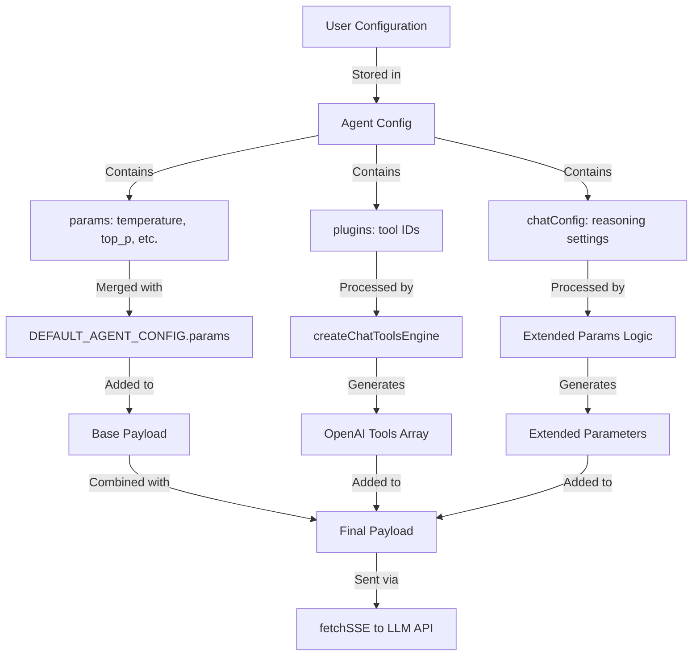

# LLM Configuration Flow Documentation

This document explains how LLM configurations (tools, reasoning, temperature) are configured by users and sent to the LLM in the LobeChat project.

## Overview

The LLM configuration flow in LobeChat follows this path:

1. **User Configuration** → Stored in agent config
2. **Request Preparation** → Merged with defaults and processed
3. **Payload Construction** → Extended parameters added based on model capabilities
4. **API Request** → Sent to LLM via chat service

---

## 1. Configuration Storage

### Default Configuration

All default LLM configurations are defined in [`packages/const/src/settings/agent.ts`](file:///Users/yuda/github.com/lobehub/lobe-chat/packages/const/src/settings/agent.ts):

```typescript
export const DEFAULT_AGENT_CONFIG: LobeAgentConfig = {
  chatConfig: DEFAULT_AGENT_CHAT_CONFIG,
  model: DEFAULT_MODEL,
  params: {
    frequency_penalty: 0,
    presence_penalty: 0,
    temperature: 1,
    top_p: 1,
  },
  plugins: [],
  provider: DEFAULT_PROVIDER,
  systemRole: '',
  tts: DEFAUTT_AGENT_TTS_CONFIG,
};
```

### Configuration Types

#### Agent Configuration (`LobeAgentConfig`)

Defined in [`packages/types/src/agent/item.ts`](file:///Users/yuda/github.com/lobehub/lobe-chat/packages/types/src/agent/item.ts):

- **`model`**: The LLM model to use (e.g., `gpt-5-mini`)
- **`provider`**: The model provider (e.g., `openai`)
- **`params`**: LLM parameters from `model-bank` library
  - `temperature`: Controls randomness (0-2, default: 1)
  - `top_p`: Nucleus sampling parameter (0-1, default: 1)
  - `frequency_penalty`: Penalizes frequent tokens (default: 0)
  - `presence_penalty`: Penalizes repeated topics (default: 0)
- **`plugins`**: Array of enabled plugin IDs (tools)
- **`chatConfig`**: Chat-specific configuration
- **`systemRole`**: System prompt for the agent

#### Chat Configuration (`LobeAgentChatConfig`)

Defined in [`packages/types/src/agent/chatConfig.ts`](file:///Users/yuda/github.com/lobehub/lobe-chat/packages/types/src/agent/chatConfig.ts):

- **`enableReasoning`**: Whether to enable reasoning mode (default: `false`)
- **`reasoningBudgetToken`**: Token budget for reasoning (default: `1024`)
- **`reasoningEffort`**: Reasoning intensity (`'low' | 'medium' | 'high'`)
- **`gpt5ReasoningEffort`**: GPT-5 specific reasoning effort (`'minimal' | 'low' | 'medium' | 'high'`)
- **`textVerbosity`**: Output verbosity level (`'low' | 'medium' | 'high'`)
- **`thinking`**: Thinking mode (`'disabled' | 'auto' | 'enabled'`)
- **`thinkingBudget`**: Token budget for thinking
- **`enableStreaming`**: Enable streaming responses (default: `true`)
- **`historyCount`**: Number of history messages to include (default: `20`)
- **`searchMode`**: Search mode configuration

---

## 2. Request Preparation

### Chat Service Entry Point

The main entry point is [`src/services/chat/index.ts`](file:///Users/yuda/github.com/lobehub/lobe-chat/src/services/chat/index.ts):

#### Step 1: Merge User Configuration with Defaults

In the `createAssistantMessage` method (lines 75-210):

```typescript
const payload = merge(
  {
    model: DEFAULT_AGENT_CONFIG.model,
    stream: true,
    ...DEFAULT_AGENT_CONFIG.params,  // temperature, top_p, etc.
  },
  params,  // User-provided parameters override defaults
);
```

#### Step 2: Process Tools (Plugins)

Tools are generated from enabled plugins (lines 90-103):

```typescript
const pluginIds = [...(enabledPlugins || [])];

const toolsEngine = createChatToolsEngine({
  model: payload.model,
  provider: payload.provider!,
});

const { tools, enabledToolIds } = toolsEngine.generateToolsDetailed({
  model: payload.model,
  provider: payload.provider!,
  toolIds: pluginIds,
});
```

The `createChatToolsEngine` function (from `@/helpers/toolEngineering`) converts plugin IDs into OpenAI-compatible tool definitions that are sent to the LLM.

#### Step 3: Process Messages with Context Engineering

Messages are processed through context engineering (lines 112-125):

```typescript
const oaiMessages = await contextEngineering({
  enableHistoryCount: agentChatConfigSelectors.enableHistoryCount(agentStoreState),
  historyCount: agentChatConfigSelectors.historyCount(agentStoreState) + 2,
  historySummary: options?.historySummary,
  inputTemplate: chatConfig.inputTemplate,
  messages,
  model: payload.model,
  provider: payload.provider!,
  systemRole: agentConfig.systemRole,
  tools: enabledToolIds,
});
```

This function:
- Applies the system role
- Manages conversation history
- Formats messages for the LLM API

---

## 3. Extended Parameters Processing

### Reasoning Configuration

Extended parameters are conditionally added based on model capabilities (lines 127-198):

```typescript
let extendParams: Record<string, any> = {};

const isModelHasExtendParams = aiModelSelectors.isModelHasExtendParams(
  payload.model,
  payload.provider!,
)(aiInfraStoreState);

if (isModelHasExtendParams) {
  const modelExtendParams = aiModelSelectors.modelExtendParams(
    payload.model,
    payload.provider!,
  )(aiInfraStoreState);

  // Reasoning configuration
  if (modelExtendParams!.includes('enableReasoning')) {
    if (chatConfig.enableReasoning) {
      extendParams.thinking = {
        budget_tokens: chatConfig.reasoningBudgetToken || 1024,
        type: 'enabled',
      };
    } else {
      extendParams.thinking = {
        budget_tokens: 0,
        type: 'disabled',
      };
    }
  }

  // Reasoning effort
  if (modelExtendParams!.includes('reasoningEffort') && chatConfig.reasoningEffort) {
    extendParams.reasoning_effort = chatConfig.reasoningEffort;
  }

  // GPT-5 reasoning effort
  if (modelExtendParams!.includes('gpt5ReasoningEffort') && chatConfig.gpt5ReasoningEffort) {
    extendParams.reasoning_effort = chatConfig.gpt5ReasoningEffort;
  }

  // Text verbosity
  if (modelExtendParams!.includes('textVerbosity') && chatConfig.textVerbosity) {
    extendParams.verbosity = chatConfig.textVerbosity;
  }

  // Thinking mode
  if (modelExtendParams!.includes('thinking') && chatConfig.thinking) {
    extendParams.thinking = { type: chatConfig.thinking };
  }

  // Thinking budget
  if (modelExtendParams!.includes('thinkingBudget') && chatConfig.thinkingBudget !== undefined) {
    extendParams.thinkingBudget = chatConfig.thinkingBudget;
  }
}
```

### Key Points:

1. **Model-Specific Parameters**: Extended parameters are only added if the model supports them
2. **Conditional Logic**: Each parameter has specific conditions for inclusion
3. **Parameter Transformation**: User-facing config is transformed into API-compatible format

---

## 4. Payload Construction and API Request

### Final Payload Assembly

The final payload is assembled in `getChatCompletion` (lines 235-273):

```typescript
const payload = merge(
  {
    model: DEFAULT_AGENT_CONFIG.model,
    stream: chatConfig.enableStreaming !== false,  // Default to true
    ...DEFAULT_AGENT_CONFIG.params,  // temperature, top_p, etc.
  },
  { ...res, apiMode, model },
);

// Convert null to undefined to prevent sending null values
if (payload.temperature === null) payload.temperature = undefined;
if (payload.top_p === null) payload.top_p = undefined;
if (payload.presence_penalty === null) payload.presence_penalty = undefined;
if (payload.frequency_penalty === null) payload.frequency_penalty = undefined;
```

### API Request

The payload is sent via Server-Sent Events (SSE) to the chat endpoint (lines 338-349):

```typescript
return fetchSSE(API_ENDPOINTS.chat(sdkType), {
  body: JSON.stringify(payload),  // Final payload with all configurations
  fetcher: fetcher,
  headers,
  method: 'POST',
  onAbort: options?.onAbort,
  onErrorHandle: options?.onErrorHandle,
  onFinish: options?.onFinish,
  onMessageHandle: options?.onMessageHandle,
  responseAnimation: mergedResponseAnimation,
  signal,
});
```

---

## Configuration Flow Summary



---

## Key Files Reference

| File | Purpose |
|------|---------|
| [`packages/const/src/settings/agent.ts`](file:///Users/yuda/github.com/lobehub/lobe-chat/packages/const/src/settings/agent.ts) | Default configuration values |
| [`packages/types/src/agent/item.ts`](file:///Users/yuda/github.com/lobehub/lobe-chat/packages/types/src/agent/item.ts) | `LobeAgentConfig` type definition |
| [`packages/types/src/agent/chatConfig.ts`](file:///Users/yuda/github.com/lobehub/lobe-chat/packages/types/src/agent/chatConfig.ts) | `LobeAgentChatConfig` type definition |
| [`src/services/chat/index.ts`](file:///Users/yuda/github.com/lobehub/lobe-chat/src/services/chat/index.ts) | Main chat service with request processing |
| [`src/helpers/toolEngineering`](file:///Users/yuda/github.com/lobehub/lobe-chat/src/helpers/toolEngineering) | Tool/plugin conversion logic |
| [`src/services/chat/contextEngineering.ts`](file:///Users/yuda/github.com/lobehub/lobe-chat/src/services/chat/contextEngineering.ts) | Message preprocessing and context management |

---

## Example: Complete Configuration Flow

### 1. User Sets Configuration

```typescript
// User configures agent with:
{
  model: "gpt-4o",
  provider: "openai",
  params: {
    temperature: 0.7,
    top_p: 0.9
  },
  plugins: ["web-search", "calculator"],
  chatConfig: {
    enableReasoning: true,
    reasoningBudgetToken: 2048,
    reasoningEffort: "high"
  }
}
```

### 2. Request Preparation

```typescript
// Merged payload:
{
  model: "gpt-4o",
  provider: "openai",
  stream: true,
  temperature: 0.7,        // User value
  top_p: 0.9,              // User value
  frequency_penalty: 0,    // Default
  presence_penalty: 0,     // Default
  tools: [
    // Generated from plugins
    { type: "function", function: { name: "web_search", ... } },
    { type: "function", function: { name: "calculator", ... } }
  ],
  messages: [...],         // Processed messages
  // Extended params (if model supports):
  thinking: {
    budget_tokens: 2048,
    type: "enabled"
  },
  reasoning_effort: "high"
}
```

### 3. Sent to LLM

The final payload is serialized to JSON and sent to the LLM API endpoint via POST request with streaming enabled.

---

## Notes

- **Temperature Range**: Typically 0-2, where 0 is deterministic and 2 is very random
- **Tools**: Automatically converted from plugin manifests to OpenAI function calling format
- **Reasoning**: Only added to payload if the model supports extended reasoning parameters
- **Streaming**: Enabled by default unless explicitly disabled by user
- **Null Handling**: Null values are converted to undefined to prevent API errors
