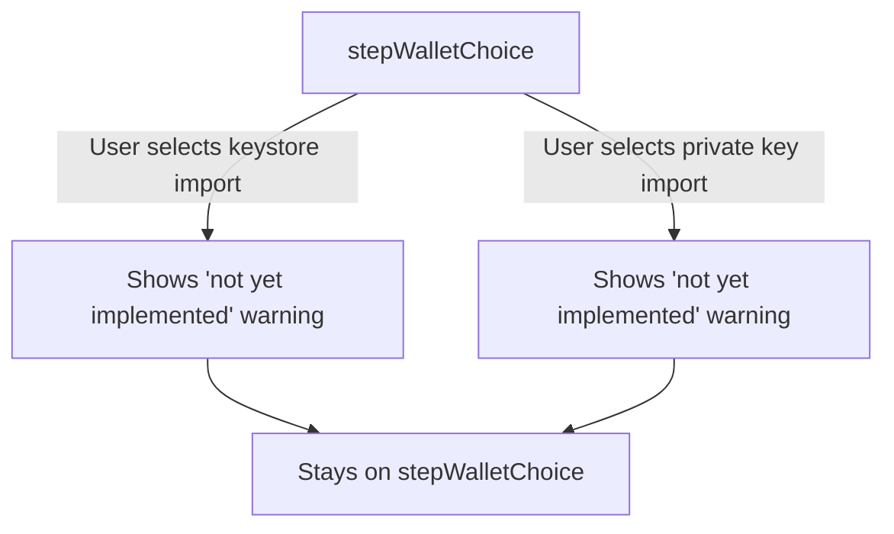
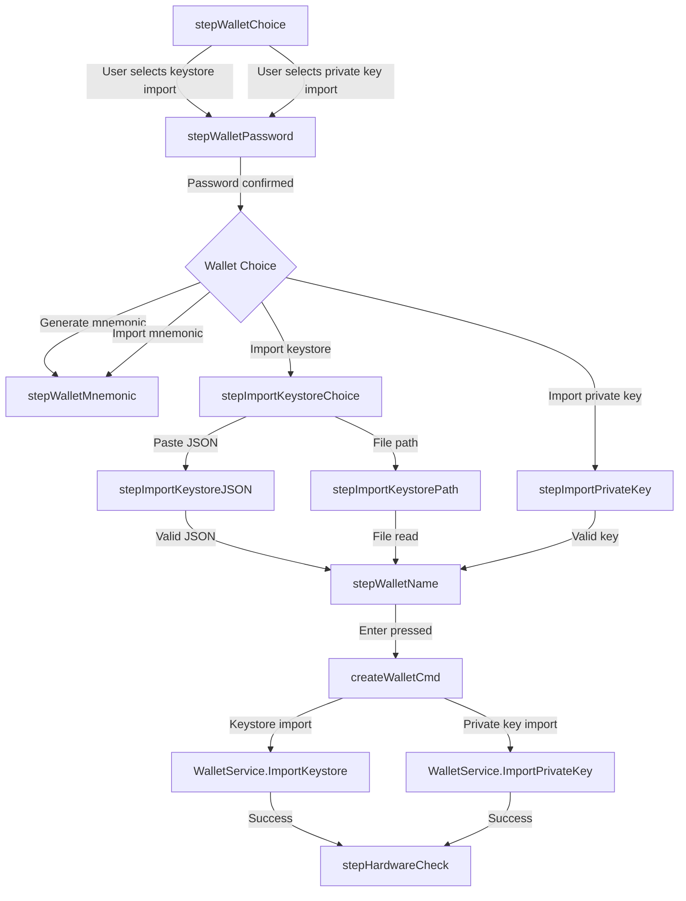

# Keystore and Private Key Import Implementation Plan

## Executive Summary

This document provides a comprehensive analysis and implementation plan for enabling keystore and private key import functionality in the TUI setup. The wallet service already has the necessary methods implemented - the TUI simply needs to call them instead of returning "not yet implemented" errors.

## Current State Analysis

### Existing Implementation Status

#### Wallet Service (Already Implemented)
The [`WalletService`](internal/services/wallet_service.go:47) in [`internal/services/wallet_service.go`](internal/services/wallet_service.go) already has two key methods:

1. **[`ImportKeystore(keystoreJSON string, password string, description string) (string, error)`](internal/services/wallet_service.go:311-375)**
   - Validates keystore JSON format
   - Extracts address from keystore
   - Checks for duplicate wallets
   - Saves keystore to file
   - Verifies by unlocking with password
   - Stores account metadata
   - Registers holder in registry

2. **[`ImportPrivateKey(privateKeyHex string, password string, description string) (string, error)`](internal/services/wallet_service.go:378-455)**
   - Validates private key format (64 hex characters)
   - Parses private key
   - Derives address from private key
   - Checks for duplicate wallets
   - Creates encrypted keystore
   - Stores account metadata
   - Unlocks and sets as current account
   - Registers holder in registry

#### TUI Setup (Partially Implemented)
The [`setup_tui.go`](cmd/server/api/services/kronk/setup_tui.go) file has:

**UI Components:**
- [`stepImportKeystoreChoice`](cmd/server/api/services/kronk/setup_tui.go:100) - Choice between paste JSON or file path
- [`stepImportKeystoreJSON`](cmd/server/api/services/kronk/setup_tui.go:101) - Input field for pasting keystore JSON
- [`stepImportKeystorePath`](cmd/server/api/services/kronk/setup_tui.go:102) - Input field for file path
- [`stepImportPrivateKey`](cmd/server/api/services/kronk/setup_tui.go:103) - Input field for private key

**View Methods:**
- [`importKeystoreChoiceView()`](cmd/server/api/services/kronk/setup_tui.go:726-750) - Shows import method selection
- [`importKeystoreJSONView()`](cmd/server/api/services/kronk/setup_tui.go:752-774) - Shows JSON input with validation
- [`importKeystorePathView()`](cmd/server/api/services/kronk/setup_tui.go:776-785) - Shows file path input
- [`importPrivateKeyView()`](cmd/server/api/services/kronk/setup_tui.go:787-820) - Shows private key input with validation

**Validation Functions:**
- [`validateKeystoreJSON(jsonStr string) (bool, string)`](cmd/server/api/services/kronk/setup_tui.go:546-572) - Validates keystore JSON format
- Private key validation in [`importPrivateKeyView()`](cmd/server/api/services/kronk/setup_tui.go:791-808) - Validates hex format and length

**Current Issues:**
1. At [`handleEnter()`](cmd/server/api/services/kronk/setup_tui.go:1000-1004), selecting keystore or private key import shows "not yet implemented" warning
2. At [`createWalletCmd()`](cmd/server/api/services/kronk/setup_tui.go:1231-1246), keystore and private key import cases return "not yet implemented" errors

## Keystore Format Requirements

### Supported Format
The implementation supports the standard Ethereum keystore format (Web3 Secret Storage Definition), which is compatible with:
- MetaMask
- MyEtherWallet
- Geth
- Parity
- Other Ethereum wallets

### Keystore JSON Structure
```json
{
  "address": "0x1234...",
  "crypto": {
    "ciphertext": "...",
    "cipherparams": {
      "iv": "..."
    },
    "cipher": "aes-128-ctr",
    "kdf": "scrypt",
    "kdfparams": {
      "dklen": 32,
      "salt": "...",
      "n": 262144,
      "r": 8,
      "p": 1
    },
    "mac": "..."
  },
  "id": "...",
  "version": 3
}
```

### Required Fields
- `address` - Ethereum address (checksummed or lowercase)
- `crypto` - Encryption information
  - `ciphertext` - Encrypted private key
  - `cipherparams` - Cipher parameters
  - `cipher` - Cipher algorithm (typically "aes-128-ctr")
  - `kdf` - Key derivation function (typically "scrypt")
  - `kdfparams` - KDF parameters
  - `mac` - Message authentication code
- `version` - Keystore version (typically 3)

### Validation Requirements
The [`validateKeystoreJSON()`](cmd/server/api/services/kronk/setup_tui.go:546-572) function currently checks:
1. JSON is not empty
2. Valid JSON format (starts with `{` and ends with `}`)
3. Required fields present: `address`, `crypto`, `version`
4. Crypto information present: `kdf` or `ciphertext`

**Note:** The actual validation happens in [`WalletService.ImportKeystore()`](internal/services/wallet_service.go:311-375) which attempts to decrypt the keystore with the provided password.

## Private Key Format Requirements

### Supported Format
- 64 hexadecimal characters (32 bytes)
- Optional `0x` or `0X` prefix
- Case-insensitive

### Validation Requirements
The [`importPrivateKeyView()`](cmd/server/api/services/kronk/setup_tui.go:791-808) function validates:
1. Length is exactly 64 characters (after removing `0x` prefix)
2. Valid hexadecimal characters

### Example Valid Private Keys
- `0x1234567890abcdef1234567890abcdef1234567890abcdef1234567890abcdef`
- `1234567890abcdef1234567890abcdef1234567890abcdef1234567890abcdef`

## Implementation Flow

### Current Flow (Broken)



### Target Flow (Fixed)



## Implementation Steps

### Step 1: Remove "Not Yet Implemented" Block

**File:** [`cmd/server/api/services/kronk/setup_tui.go`](cmd/server/api/services/kronk/setup_tui.go)

**Location:** [`handleEnter()`](cmd/server/api/services/kronk/setup_tui.go:998-1008)

**Current Code:**
```go
case stepWalletChoice:
    // Check if user selected an unimplemented option
    if m.walletChoice == 2 || m.walletChoice == 3 {
        // Keystore and private key import are not yet implemented
        // Stay on this step and show error
        return m, nil
    }
    // All other choices proceed to password setup first
    m.step = stepWalletPassword
    m.passwordInput.Focus()
    return m, nil
```

**Change To:**
```go
case stepWalletChoice:
    // All choices proceed to password setup first
    m.step = stepWalletPassword
    m.passwordInput.Focus()
    return m, nil
```

**Also Update:** [`walletChoiceView()`](cmd/server/api/services/kronk/setup_tui.go:485-516)

**Current Code:**
```go
choices := []string{
    "Generate new mnemonic (recommended)",
    "Import existing mnemonic",
    "Import keystore JSON (MetaMask, etc.) [Coming Soon]",
    "Import private key [Coming Soon]",
}
```

**Change To:**
```go
choices := []string{
    "Generate new mnemonic (recommended)",
    "Import existing mnemonic",
    "Import keystore JSON (MetaMask, etc.)",
    "Import private key",
}
```

**Remove:** Warning display at lines 508-512

### Step 2: Implement Keystore Import in createWalletCmd

**File:** [`cmd/server/api/services/kronk/setup_tui.go`](cmd/server/api/services/kronk/setup_tui.go)

**Location:** [`createWalletCmd()`](cmd/server/api/services/kronk/setup_tui.go:1231-1239)

**Current Code:**
```go
case 2: // Import keystore
    var keystoreData string
    if m.keystoreChoice == 0 {
        keystoreData = m.keystoreInput.Value()
    } else {
        keystoreData = m.keystoreInput.Value() // Already read from file
    }
    _ = keystoreData // Will be used when keystore import is implemented
    address, err = "", fmt.Errorf("keystore import not yet implemented")
```

**Change To:**
```go
case 2: // Import keystore
    var keystoreData string
    if m.keystoreChoice == 0 {
        keystoreData = m.keystoreInput.Value()
    } else {
        keystoreData = m.keystoreInput.Value() // Already read from file
    }
    password := m.passwordInput.Value()
    name := m.nameInput.Value()
    if name == "" {
        name = "Imported Wallet"
    }
    address, err = m.walletService.ImportKeystore(keystoreData, password, name)
```

### Step 3: Implement Private Key Import in createWalletCmd

**File:** [`cmd/server/api/services/kronk/setup_tui.go`](cmd/server/api/services/kronk/setup_tui.go)

**Location:** [`createWalletCmd()`](cmd/server/api/services/kronk/setup_tui.go:1241-1246)

**Current Code:**
```go
case 3: // Import private key
    privateKey := m.privateKeyInput.Value()
    privateKey = strings.TrimPrefix(privateKey, "0x")
    privateKey = strings.TrimPrefix(privateKey, "0X")
    // Try to import private key - need to check if walletService has this method
    address, err = "", fmt.Errorf("private key import not yet implemented")
```

**Change To:**
```go
case 3: // Import private key
    privateKey := m.privateKeyInput.Value()
    password := m.passwordInput.Value()
    name := m.nameInput.Value()
    if name == "" {
        name = "Imported Wallet"
    }
    address, err = m.walletService.ImportPrivateKey(privateKey, password, name)
```

### Step 4: Add Keystore Password Input (Optional Enhancement)

**Current Issue:** The keystore import requires a password to decrypt the keystore, but the current flow uses the wallet password. This is actually correct behavior - the wallet password is used to encrypt the imported keystore.

**No changes needed** - the current implementation correctly uses the wallet password for both keystore decryption and re-encryption.

## Error Handling

### Potential Errors and Handling

#### Keystore Import Errors

1. **Invalid JSON Format**
   - Error: `"invalid keystore JSON format"`
   - Source: [`WalletService.ImportKeystore()`](internal/services/wallet_service.go:314)
   - Handling: Show error in TUI, allow user to retry

2. **Missing Address Field**
   - Error: `"keystore missing address field"`
   - Source: [`WalletService.ImportKeystore()`](internal/services/wallet_service.go:321)
   - Handling: Show error in TUI, allow user to retry

3. **Wallet Already Exists**
   - Error: `"wallet with this address already exists"`
   - Source: [`WalletService.ImportKeystore()`](internal/services/wallet_service.go:329)
   - Handling: Show error in TUI, suggest using existing wallet or importing different keystore

4. **Invalid Password**
   - Error: `"invalid password for keystore"`
   - Source: [`WalletService.ImportKeystore()`](internal/services/wallet_service.go:363)
   - Handling: Show error in TUI, allow user to re-enter password

5. **Failed to Save Keystore**
   - Error: `"failed to save keystore: ..."`
   - Source: [`WalletService.ImportKeystore()`](internal/services/wallet_service.go:338)
   - Handling: Show error in TUI, check file permissions

6. **Failed to Store Account Record**
   - Error: `"failed to store account record: ..."`
   - Source: [`WalletService.ImportKeystore()`](internal/services/wallet_service.go:354)
   - Handling: Show error in TUI, rollback keystore file

#### Private Key Import Errors

1. **Invalid Private Key Length**
   - Error: `"invalid private key: must be 64 hex characters"`
   - Source: [`WalletService.ImportPrivateKey()`](internal/services/wallet_service.go:386)
   - Handling: Show error in TUI, allow user to retry

2. **Invalid Private Key Format**
   - Error: `"invalid private key: ..."`
   - Source: [`WalletService.ImportPrivateKey()`](internal/services/wallet_service.go:392)
   - Handling: Show error in TUI, allow user to retry

3. **Failed to Derive Public Key**
   - Error: `"failed to derive public key"`
   - Source: [`WalletService.ImportPrivateKey()`](internal/services/wallet_service.go:399)
   - Handling: Show error in TUI, this should not happen with valid private key

4. **Wallet Already Exists**
   - Error: `"wallet with this address already exists"`
   - Source: [`WalletService.ImportPrivateKey()`](internal/services/wallet_service.go:406)
   - Handling: Show error in TUI, suggest using existing wallet or importing different private key

5. **Failed to Create Keystore**
   - Error: `"failed to create keystore: ..."`
   - Source: [`WalletService.ImportPrivateKey()`](internal/services/wallet_service.go:413)
   - Handling: Show error in TUI, check file permissions

6. **Failed to Unlock Imported Wallet**
   - Error: `"failed to unlock imported wallet: ..."`
   - Source: [`WalletService.ImportPrivateKey()`](internal/services/wallet_service.go:443)
   - Handling: Show error in TUI, rollback keystore file

### Error Display in TUI

The TUI already has error handling in place:
- Errors are collected in `m.errors` slice
- [`errorView()`](cmd/server/api/services/kronk/setup_tui.go:958-973) displays all errors
- [`walletCreatedMsg`](cmd/server/api/services/kronk/setup_tui.go:189-192) handling at lines 330-340

**No changes needed** - the existing error handling is sufficient.

## Dependencies

### Required Dependencies (Already Present)

1. **go-ethereum** - Ethereum library
   - `github.com/ethereum/go-ethereum/accounts/keystore`
   - `github.com/ethereum/go-ethereum/crypto`
   - Used by [`WalletService`](internal/services/wallet_service.go:47)

2. **jarvis/accounts** - Internal account management
   - `github.com/kawai-network/x/jarvis/accounts`
   - Used by [`WalletService`](internal/services/wallet_service.go:47)

3. **bubbletea** - TUI framework
   - `github.com/charmbracelet/bubbletea`
   - Used by [`setup_tui.go`](cmd/server/api/services/kronk/setup_tui.go)

### No New Dependencies Required

All necessary dependencies are already present in the project.

## Testing Strategy

### Unit Tests

1. **Test Keystore Import**
   - Test with valid MetaMask keystore
   - Test with invalid JSON
   - Test with missing password
   - Test with wrong password
   - Test with duplicate wallet

2. **Test Private Key Import**
   - Test with valid private key
   - Test with invalid length
   - Test with invalid hex characters
   - Test with duplicate wallet

### Integration Tests

1. **Test Full TUI Flow**
   - Test keystore import flow from start to finish
   - Test private key import flow from start to finish
   - Test error handling and recovery

### Manual Testing

1. **Test with MetaMask Keystore**
   - Export keystore from MetaMask
   - Import via TUI
   - Verify wallet is accessible

2. **Test with Private Key**
   - Generate private key
   - Import via TUI
   - Verify wallet is accessible

## Security Considerations

### Keystore Security

1. **Password Protection**
   - Keystore is encrypted with user-provided password
   - Password is never stored in plaintext
   - Password is used to decrypt keystore during import

2. **File Permissions**
   - Keystore files are created with `0600` permissions (owner read/write only)
   - Keystore directory is created with `0755` permissions

3. **Validation**
   - Keystore is validated by attempting to decrypt with provided password
   - Invalid passwords are rejected

### Private Key Security

1. **Encryption**
   - Private key is immediately encrypted using standard keystore encryption
   - Uses scrypt KDF with standard parameters (n=262144, p=1)

2. **No Plaintext Storage**
   - Private key is never stored in plaintext
   - Only encrypted keystore is stored

3. **Validation**
   - Private key is validated before encryption
   - Invalid keys are rejected

### Memory Security

1. **Sensitive Data in Memory**
   - Private key and password are in memory during import
   - Memory is cleared when wallet is locked
   - Consider using secure memory for sensitive data (future enhancement)

## Rollback Plan

If issues arise after implementation:

1. **Revert Changes**
   - Revert changes to [`setup_tui.go`](cmd/server/api/services/kronk/setup_tui.go)
   - Restore "not yet implemented" warnings

2. **Cleanup**
   - Remove any imported wallets if needed
   - Clean up keystore files if needed

3. **Notify Users**
   - Update documentation to reflect status
   - Communicate with users about the rollback

## Timeline

### Implementation Tasks

1. **Remove "Not Yet Implemented" Block** - 5 minutes
   - Update [`handleEnter()`](cmd/server/api/services/kronk/setup_tui.go:998-1008)
   - Update [`walletChoiceView()`](cmd/server/api/services/kronk/setup_tui.go:485-516)

2. **Implement Keystore Import** - 5 minutes
   - Update [`createWalletCmd()`](cmd/server/api/services/kronk/setup_tui.go:1231-1239)

3. **Implement Private Key Import** - 5 minutes
   - Update [`createWalletCmd()`](cmd/server/api/services/kronk/setup_tui.go:1241-1246)

4. **Testing** - 30 minutes
   - Unit tests
   - Integration tests
   - Manual testing

**Total Estimated Time: 45 minutes**

## Conclusion

The implementation of keystore and private key import is straightforward because:

1. **Wallet Service Methods Already Exist** - [`ImportKeystore()`](internal/services/wallet_service.go:311-375) and [`ImportPrivateKey()`](internal/services/wallet_service.go:378-455) are fully implemented
2. **TUI UI Already Exists** - All necessary UI components and validation are in place
3. **Minimal Code Changes Required** - Only need to call the existing methods instead of returning errors
4. **No New Dependencies** - All required libraries are already present
5. **Error Handling Already in Place** - The TUI has comprehensive error handling

The implementation is essentially connecting the existing UI to the existing backend methods, making it a low-risk, high-value change.
